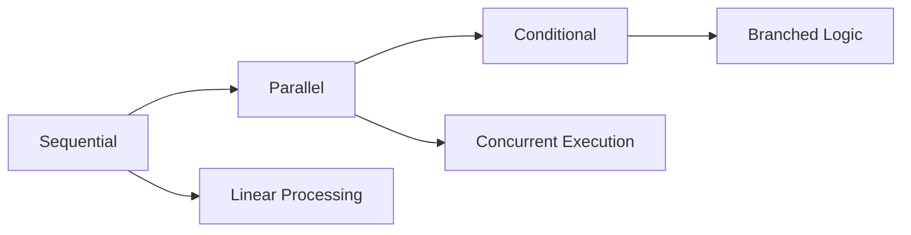
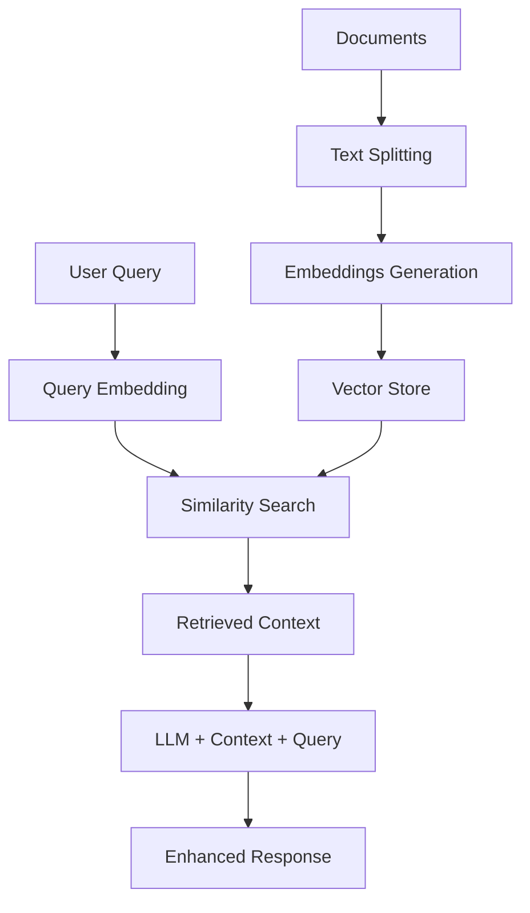
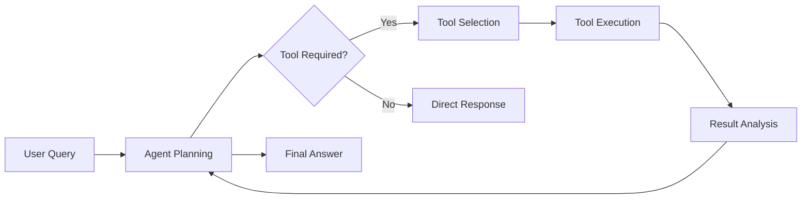

# Geerative AI using Langchain

A comprehensive collection of LangChain implementations covering core concepts from basic language models to advanced AI agents and RAG systems.

## 📚 Repository Structure

```
├── langchain-models/          # Foundation language models and embeddings
├── langchain-prompts/         # Prompt engineering techniques
├── structured-output/         # Output parsing and structured responses
├── langchain-chains/          # Chain composition patterns
├── langchain-runnables/       # Advanced runnable operations
├── RAG/                      # Retrieval-Augmented Generation
└── langchain-AI-agents/      # AI agents with tool integration
```

## 🔧 Core Concepts

### 1. Language Models (`langchain-models/`)

| Model Type | Purpose | Key Features |
|------------|---------|--------------|
| **LLMs** | Text completion | Direct text generation, single prompt-response |
| **Chat Models** | Conversational AI | Message-based interactions, context awareness |
| **Embeddings** | Vector representations | Semantic similarity, document search capabilities |

**Key Concepts:**
- **LLMs vs Chat Models**: LLMs work with simple text strings while chat models handle structured message conversations
- **Model Providers**: Support for OpenAI, HuggingFace API, and local HuggingFace models
- **Temperature Control**: Adjusting randomness in model outputs (0 = deterministic, 2 = highly creative)
- **Embedding Models**: Convert text into numerical vectors for similarity comparisons
- **Document Similarity**: Using cosine similarity between embedding vectors to find related content

**Key Files:**
- `LLMs.py` - Basic language model usage with OpenAI
- `chat_model_hf_*.py` - HuggingFace chat model implementations (API and local)
- `embedding_model.py` - Text-to-vector conversion examples
- `document_similarity.py` - Semantic document matching with similarity scores

### 2. Prompt Engineering (`langchain-prompts/`)

Structured approaches to crafting effective prompts for better model responses:

```
SystemMessage → HumanMessage → AIMessage
```

**Core Components:**
- **PromptTemplate**: Create reusable prompts with variable placeholders
- **ChatPromptTemplate**: Structure multi-role conversations with system instructions
- **MessagesPlaceholder**: Insert dynamic chat history into prompt templates
- **Message Types**: System (instructions), Human (user input), AI (model responses)

**Advanced Features:**
- **Variable Substitution**: Dynamic content insertion using `{variable_name}` syntax
- **Partial Variables**: Pre-fill some template variables while keeping others dynamic
- **Template Validation**: Ensure all required variables are provided
- **Chat History Management**: Maintain conversation context across multiple interactions
- **Role-Based Prompting**: Different instructions for system, user, and assistant roles

**Key Files:**
- `prompt_generator.py` - Template creation and saving
- `chatbot.py` - Conversational AI with memory
- `message_placeholder.py` - Dynamic chat history integration

### 3. Structured Output (`structured-output/`)

Transform unstructured LLM responses into predictable, typed data formats:

| Parser Type | Use Case | Output Format | Validation |
|-------------|----------|---------------|------------|
| **StrOutputParser** | Simple text extraction | String | None |
| **JSONOutputParser** | Structured data | JSON object | Schema validation |
| **PydanticOutputParser** | Type-safe responses | Pydantic model | Type checking |

**Key Concepts:**
- **Output Consistency**: Ensure LLM responses follow expected formats
- **Type Safety**: Use Pydantic models for automatic validation and type hints
- **Schema Definition**: Define expected output structure before generation
- **Error Handling**: Graceful handling of malformed responses
- **Format Instructions**: Auto-generated prompts that guide model output formatting

**Implementation Approaches:**
- **with_structured_output()**: Modern method using model's native structured output
- **Output Parsers**: Traditional approach with post-processing validation

### 4. Chains (`langchain-chains/`)

Combine multiple LLM calls and operations into sophisticated workflows:



**Chain Types:**

- **Sequential Chains**: 
  - Process data step-by-step through multiple prompts
  - Output of one step becomes input of the next
  - Useful for multi-step reasoning tasks

- **Parallel Chains**: 
  - Execute multiple operations simultaneously
  - Combine results from different processing paths
  - Efficient for independent tasks that can run concurrently

- **Conditional Chains**: 
  - Branch execution based on input characteristics or intermediate results
  - Use RunnableBranch for if-then-else logic
  - Enable dynamic workflow routing

**Practical Applications:**
- **Content Generation**: Generate report → extract key points → create summary
- **Multi-format Output**: Create tweet + LinkedIn post + email simultaneously  
- **Feedback Processing**: Classify sentiment → route to appropriate response template

### 5. Runnables (`langchain-runnables/`)

Advanced composition patterns for complex LLM application architectures:

| Runnable | Function | Example Use Case |
|----------|----------|------------------|
| **RunnableSequence** | Chain operations | prompt \| model \| parser |
| **RunnableParallel** | Concurrent tasks | {summary: chain1, questions: chain2} |
| **RunnablePassthrough** | Data forwarding | Pass original input alongside processed results |
| **RunnableLambda** | Custom functions | Word counting, data transformation |
| **RunnableBranch** | Conditional routing | Route based on content length or type |

**Advanced Patterns:**
- **Pipeline Composition**: Use `|` operator to connect components seamlessly
- **Data Flow Control**: Manage how information flows between different processing steps
- **Conditional Processing**: Dynamically choose processing paths based on input characteristics
- **Custom Logic Integration**: Embed Python functions directly into LangChain pipelines
- **Error Handling**: Built-in retry mechanisms and fallback strategies

**Real-world Applications:**
- **Content Analysis**: Generate content → analyze quality → provide feedback
- **Document Processing**: Load document → extract key info → generate multiple outputs
- **Interactive Systems**: User input → process conditionally → provide tailored responses

## 🔍 Retrieval-Augmented Generation (RAG)

RAG enhances LLM responses by incorporating relevant external knowledge, solving the knowledge cutoff problem:

### RAG Pipeline Architecture



### Document Loaders (`RAG/document-loaders/`)

Transform various data sources into LangChain-compatible document format:

| Loader | Supported Formats | Key Features | Use Cases |
|--------|------------------|--------------|-----------|
| **TextLoader** | .txt files | Encoding handling, large file support | Knowledge bases, articles |
| **PyPDFLoader** | .pdf files | Page-by-page loading, metadata extraction | Research papers, manuals |
| **CSVLoader** | .csv files | Column mapping, custom parsing | Structured datasets, reports |
| **WebBaseLoader** | Web URLs | Dynamic content scraping, link following | Live data, documentation |
| **DirectoryLoader** | Multiple files | Batch processing, file filtering | Document collections |

**Key Concepts:**
- **Document Structure**: Each document contains `page_content` (text) and `metadata` (source info)
- **Encoding Management**: Handle different character encodings (UTF-8, ASCII, etc.)
- **Metadata Preservation**: Keep source information for citation and filtering
- **Batch Processing**: Efficiently handle large document collections
- **Content Cleaning**: Remove formatting artifacts and normalize text

### Text Splitters (`RAG/text-splitters/`)

Break documents into optimal chunks for embedding and retrieval:

**Splitting Strategies:**

1. **Length-based Splitting**:
   - Fixed character or token limits
   - Simple overlap for context preservation
   - Fast processing for uniform content

2. **Semantic Splitting**:
   - Use embeddings to identify topic boundaries
   - Preserve meaning-coherent chunks
   - Better for complex, varied content

3. **Structure-based Splitting**:
   - Language-aware parsing (Python, Markdown, etc.)
   - Respect logical document structure
   - Maintain code blocks and formatting

**Configuration Parameters:**
- **Chunk Size**: Balance between context richness and processing efficiency
- **Chunk Overlap**: Prevent information loss at boundaries
- **Separators**: Define natural break points (paragraphs, sentences, etc.)

```python
# Optimal configuration example
splitter = RecursiveCharacterTextSplitter(
    chunk_size=1000,        # Large enough for context
    chunk_overlap=200,      # 20% overlap prevents information loss
    separators=["\n\n", "\n", ".", "!", "?", " ", ""]  # Natural break points
)
```

### Vector Stores & Retrievers

**Vector Store Operations:**
- **Embedding Storage**: Persist high-dimensional vectors efficiently
- **Similarity Search**: Find semantically related content using cosine similarity
- **Metadata Filtering**: Combine semantic search with structured filters
- **Index Management**: Add, update, and delete documents dynamically

**Retriever Strategies:**

| Retriever | Method | Benefits | Best For |
|-----------|--------|----------|----------|
| **Similarity** | Cosine similarity | Simple, fast | Direct question answering |
| **MMR** | Maximum Marginal Relevance | Diverse results, reduces redundancy | Exploratory research |
| **MultiQuery** | Multiple query variations | Comprehensive coverage | Complex, multi-faceted questions |
| **Contextual Compression** | LLM-based filtering | Precise, relevant excerpts | Long documents, specific queries |

**Advanced Retrieval Concepts:**
- **Hybrid Search**: Combine keyword and semantic search for better accuracy
- **Reranking**: Use additional models to improve result ordering
- **Query Expansion**: Generate multiple query variations for broader coverage
- **Context Compression**: Extract only relevant portions from retrieved documents

### RAG System Implementation

**Key Components:**
- **Indexing Pipeline**: Document loading → splitting → embedding → storage
- **Retrieval Pipeline**: Query → embedding → search → ranking → selection
- **Generation Pipeline**: Context + query → prompt → LLM → response

**Performance Optimization:**
- **Chunk Size Tuning**: Experiment with different sizes for your content type
- **Embedding Model Selection**: Choose models optimized for your domain
- **Retrieval Parameters**: Adjust similarity thresholds and result counts
- **Context Window Management**: Fit retrieved content within LLM limits

**Applications in Repository:**
- **YouTube Chatbot**: Video transcript-based Q&A with timestamp references
- **PDF Reader**: Academic paper analysis and question answering
- **Knowledge Base**: Multi-document information synthesis

## 🤖 AI Agents (`langchain-AI-agents/`)

AI agents combine reasoning capabilities with external tool access for complex task execution:

### Agent Architecture & Reasoning



**Core Concepts:**
- **Reasoning Loop**: Agents think before acting, analyze results, and plan next steps
- **Tool Integration**: Access external APIs, databases, and computational resources  
- **Memory Management**: Maintain conversation context and intermediate results
- **Error Handling**: Recover from tool failures and adapt strategies

### Tool System

**Tool Creation Methods:**

1. **@tool Decorator** (Simplest):
   - Add decorator to regular Python functions
   - Automatic schema generation from type hints
   - Built-in error handling and validation

2. **StructuredTool** (Flexible):
   - Custom argument schemas using Pydantic
   - Advanced validation and documentation
   - Better control over tool behavior

3. **BaseTool** (Advanced):
   - Full customization of tool behavior
   - Async support and complex logic
   - Integration with external systems

**Tool Categories:**
- **Built-in Tools**: DuckDuckGo search, shell commands, file operations
- **API Tools**: Weather data, currency conversion, web scraping
- **Custom Tools**: Domain-specific functions tailored to your needs
- **Composite Tools**: Tools that use other tools internally

**Tool Integration Best Practices:**
- **Type Safety**: Use proper type hints for automatic validation
- **Error Handling**: Graceful failure modes and informative error messages
- **Documentation**: Clear descriptions help agents choose appropriate tools
- **Security**: Validate inputs and limit tool capabilities appropriately

### Agent Patterns & Strategies

**ReAct Pattern** (Reasoning + Acting):
- **Observation**: Analyze current situation and available information
- **Thought**: Plan next action based on observations
- **Action**: Execute chosen tool or provide response
- **Reflection**: Evaluate results and adjust strategy

**Multi-step Task Decomposition:**
- Break complex queries into manageable subtasks
- Execute subtasks sequentially or in parallel
- Synthesize results into comprehensive responses
- Handle dependencies between subtasks

**Agent Types:**
- **Conversational Agents**: Natural dialogue with tool access
- **Task-Specific Agents**: Optimized for particular domains
- **Multi-Agent Systems**: Collaborative agents with different specializations

**Real-world Applications:**
- **Research Assistant**: Web search + data analysis + report generation  
- **Customer Support**: Knowledge base search + ticket creation + escalation
- **Content Creation**: Research + writing + fact-checking + formatting

## 🚀 Getting Started

### Installation & Setup

1. **Install Dependencies:**
   ```bash
   pip install -r requirements.txt
   ```

2. **Environment Configuration:**
   ```bash
   # Create .env file
   HUGGINGFACEHUB_API_TOKEN=your_hf_token
   OPENAI_API_KEY=your_openai_key
   WEATHERSTACK_API_KEY=your_weather_key  # For agent examples
   ```

3. **Verify Installation:**
   ```bash
   # Test basic functionality
   python langchain-models/embedding_model.py
   ```

### Learning Progression

| Phase | Focus Areas | Key Skills Developed |
|-------|-------------|---------------------|
| **Foundation** | Models & Prompts | LLM integration, prompt design |
| **Intermediate** | Chains & RAG | Workflow composition, knowledge retrieval |
| **Advanced** | Agents & Tools | Tool integration, complex reasoning |

### Example Workflows

**Basic Chain Example:**
```bash
python langchain-chains/sequential_chain.py
```

**RAG System Example:**
```bash
jupyter notebook RAG/youtubeChatbot.ipynb
```

**AI Agent Example:**
```bash
jupyter notebook langchain-AI-agents/tool_calling.ipynb
```

## 📊 Technical Architecture

### Integration Patterns

**Model Abstraction**: Unified interface for different model providers
**Prompt Management**: Template-based prompt engineering with versioning
**Output Processing**: Consistent parsing across different output formats
**Error Handling**: Robust error recovery and fallback mechanisms

### Performance Considerations

- **Caching**: Implement result caching for expensive operations
- **Batching**: Process multiple items simultaneously when possible
- **Streaming**: Handle large responses with streaming protocols
- **Rate Limiting**: Respect API limits and implement backoff strategies

## 🔗 Key Dependencies & Ecosystem

### Core Libraries
- **langchain**: Main framework for LLM applications
- **langchain-community**: Extended integrations and tools
- **langchain-huggingface**: HuggingFace model support
- **langchain-openai**: OpenAI model integration

### Specialized Components
- **faiss-cpu**: High-performance vector similarity search
- **chromadb**: Production-ready vector database
- **pydantic**: Data validation and settings management
- **streamlit**: Rapid web interface development

### Development Tools
- **python-dotenv**: Environment variable management
- **jupyter**: Interactive development and experimentation
- **tiktoken**: Token counting for OpenAI models

This repository demonstrates practical implementation patterns for building sophisticated LLM applications, from basic text generation to complex multi-agent systems with external tool integration.
